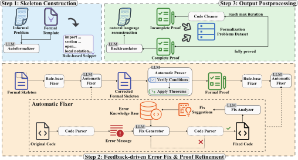

# SITA: A Framework for Structure-to-Instance Theorem Autoformalization

SITA is a framework that automates the formalization of mathematical theorems in Lean by bridging abstract structures and their concrete instances.

## ✨ Highlights

- Accepted at AAAI 2026.
- Structure-to-instance formalization workflow for Lean.
- Template-driven abstraction to reuse formalized structures.
- LLM-assisted generation with feedback-guided refinement.

## 🧭 Pipeline

<p align="center">
  
</p>

The pipeline starts from informal theorem statements, applies structure-aware parsing and template matching, and then performs LLM-assisted generation with rule-based fixes and verification feedback.

## 📁 Project Structure

```
SITA/
├── fig/
│   ├── pipeline.pdf            # Original pipeline diagram
│   └── pipeline.svg            # Vector image for README
├── Code/
│   ├── data/
│   │   ├── api/                 # Configuration for external model calls
│   │   ├── bugfix/              # Known Lean error patterns and fixes
│   │   ├── theorem_database/    # Theorem knowledge base (JSON)
|   |   └── problem/             # Test problem
│   └── lean/
│   │   ├── lakefile.lean        # Lean project entry
│   │   └── Optlib/
│   │       ├── Autoformalization/Example   # Autoformalization example
|   |       ├── Autoformalization/Template  # Autoformalization template
│   │       └── ...                         # Adapted from https://github.com/optsuite/optlib, 
|   |                                       # licensed under Apache 2.0 license as described in the file LICENSE_Optlib.
|   |                                       # Attribution will be restored after review.
|   └── src/                     # Generation code and pipeline modules
|   |   ├── main.py              # End-to-end entry point
|   |   ├── first_generation.py  # Initial formalization pass
|   |   ├── majorty_voting.py    # Voting-based validation
|   |   └── rulebased_fixer.py   # Rule-based Lean fixes
|   └── tool/model_downloader.py # Download the model needed
```

## 🚀 Getting Started

### Build

```bash
# Build the Lean project (run from repo root).
cd SITA/Code/lean
lake build
```

> Notes:
> - Ensure all `.json` files in `Code/data/` are accessible to any scripts or tools that perform autoformalization.
> - If you have not downloaded the model needed for error classification yet, run `python Code/tool/model_downloader.py` first.

## 🧪 Usage

- Integration with LLMs: (by `api/config.json`) for statement completion and proof suggestion.

- Run generation:

  ```bash
  # Generates formalizations based on config and input problems.
  python Code/src/main.py
  ```

## 📄 Citation

If you find our paper or our code useful, we would appreciate it if you could cite our work:

```bibtex
@misc{li2025sita,
  title={SITA: A Framework for Structure-to-Instance Theorem Autoformalization}, 
  author={Chenyi Li and Wanli Ma and Zichen Wang and Zaiwen Wen},
  year={2025},
  eprint={2511.10356},
  archivePrefix={arXiv},
}
```
